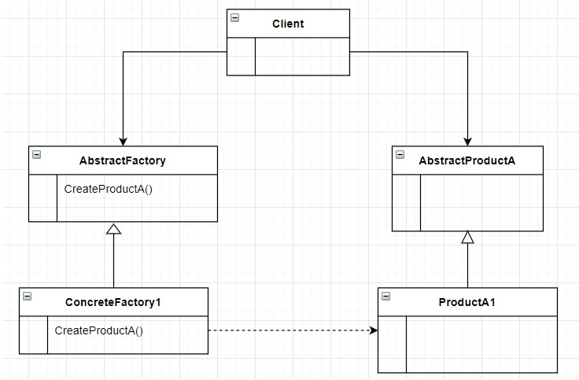

<h1 style="text-align: center">Abstract Factory</h1>

<h3>Intenção</h3>

Fornecer uma interface para criar familias de objetos relacionados ou dependentes sem especificar sua classe concreta.

<h3>Sobre</h3>
<ul>
    <li>Lida com a criação de objetos.</li>
    <li>Este padrão ajuda a controlar as classes de objetos que uma aplicação cria.</li>
    <li>Torna uma troca de familias de produtos algo simples.</li>
</ul>

<h3>Estrutura</h3>

