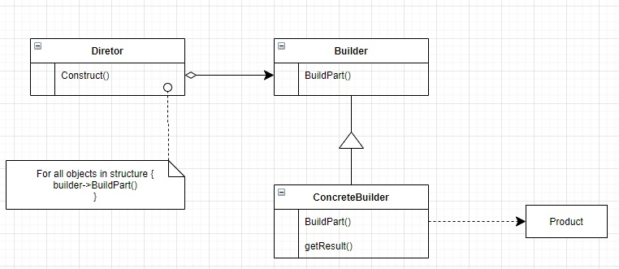

<h1>Builder</h1>

<h3>Intenção</h3>

Separar a construção de objetos complexos da sua representação, então o mesmo processo de construção pode criar diferentes representações.

<h3>Sobre o builder</h3>
<ul>
    <li>O builder faz parte dos padrões de criação</li>
    <li>Permite que voce varie o produto das representações internas </li>
    <li>Isola o código pra construção e representação</li>
    <li>O cliente não precisa saber da estrutura interna</li>
</ul>

<h3>Aplicabilidade</h3>
<ul>
    <li>Quando o algoritmo precisa criar objetos complexos que devem ser independentes das partes que fazem o objeto e como eles são montados.</li>
    <li>O processo de construção deve permitir diferentes representações do objeto construido.</li>
</ul>

<h3>Estrutura</h3>
