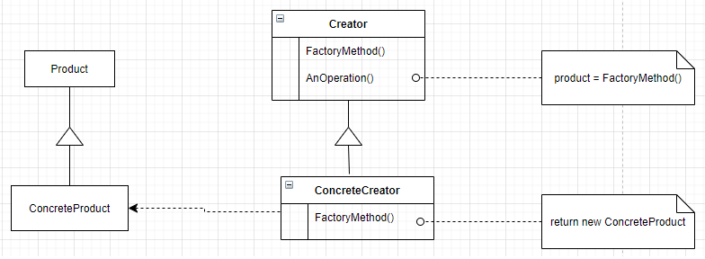

# Factory Method

### Intenção
Defina uma interface para a criação de um objeto, mas deixe as subclasses decidir qual classe a ser instanciada. Factory method deixa a classe adiar a instanciação para as subclasses.

### Sobre
* É um padrão do tipo criacional
* Esconde o código do instanciação do cliente
* 

### Aplicabilidade
* Este padrão pode ser usado quando uma classe não consegue antecipar quais outras classes de objetos devem ser criadas.
* Uma classe deseja que suas subclasses especifiquem o objeto a ser criado.
* 

### Structure
