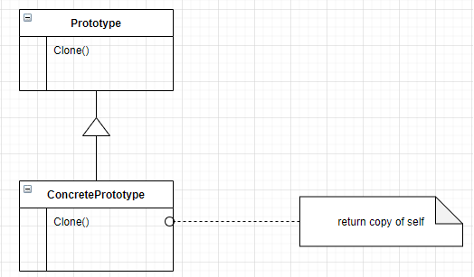

# Prototype

### Intenção
Especificar o tipo de objeto a ser criado usndo uma instância prototipica, e criar novos objetos copiando esse protótipo.

### Sobre
* É um padrão criacional.
* Esconde as classes concretas do cliente.
* Adiciona e remove produtos em tempo de execução.
* Especifica novos objetos variando os valores.
* Reduz a quantidade de subclasses.

### Aplicação
* Quando uma instancia de classe só pode ter uma de algumas combinações diferentes de estados.
* Quando se deseja evitar uma hieraquia de classes e subclasses.
* Quando uma classe a ser instanciada é especifiada em tempo de execução.

### Structure

