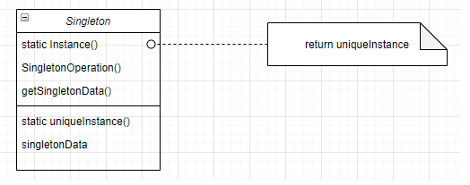

# Singleton

### Intenção
Assegurar que uma classe possua apenas uma instancia, e fornece um ponto de acesso global para quem quiser acessar.

### Sobre
* É um padrão criacional.
* O controle de acesso se da por apenas uma instancia.
* Permite mudar a quantidade de instancias que podem ser criadas.
* Mais flexique que operações de classe.

### Aplicabilidade
* Quando desejamos que a classe tenha apenas uma instancia na aplicação.
* Quando a unica instancia precisa ser extensivel para subclasses.

### Structure

